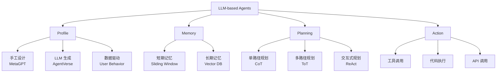

# 综述类论文分析报告片段示例

## 类型特征
- **类型**: 综述 (Survey)
- **论文示例**: "A Survey on Large Language Model based Autonomous Agents"
- **Engineering Depth**: 禁止

---

## 1. 背景与核心洞察

大模型自主智能体（LLM-based Autonomous Agents）是 2023 年以来快速发展的研究方向，其核心思想是将大语言模型作为"大脑"，通过工具调用、记忆管理和任务规划实现自主决策。然而，该领域在快速扩张中呈现出明显的碎片化特征：不同研究工作使用不同的术语描述相似模块（如"Memory"与"Context Buffer"、"Planning"与"Reasoning"），缺乏统一的框架和系统的分类，导致研究工作难以横向比较，新进入者难以快速建立领域全景图。

本综述试图解决这一混乱局面，提出一个涵盖 Profile、Memory、Planning、Action 四个模块的统一框架，并系统梳理了各模块的技术路线。其核心贡献不在于提出新方法，而在于为领域建立"共同语言"——通过统一术语和分类维度，使后续研究可以在同一坐标系下定位和比较。

---

## 2. 技术方案深度拆解

### 2.1 核心问题

如何为 LLM-based Agents 建立一个统一的分析框架，使不同研究工作可在同一维度下进行比较和定位？这一框架需要满足两个条件：覆盖智能体生命周期的关键环节，且各模块边界清晰、互不重叠。

### 2.2 方案总览

作者提出"四模块统一框架"：Profile（角色定义）、Memory（记忆管理）、Planning（任务规划）、Action（行动执行）。这一框架覆盖了智能体从"知道自己是谁"到"完成任务"的完整生命周期，四个模块之间存在明确的依赖关系：Profile 定义能力边界，Memory 提供历史信息，Planning 基于前两者生成行动策略，Action 执行策略并产生新的 Memory。

### 2.3 核心机制详解

**Profile 模块**：定义智能体的角色、能力和约束。现有工作主要从三种角度构建 Profile：手工设计（如 MetaGPT 中的角色定义，可控性强但扩展性差）、LLM 生成（如 AgentVerse 中的动态角色生成，灵活性高但一致性难以保证）和数据驱动（从用户行为数据中学习角色特征，受限于数据质量和覆盖度）。这三类方法的演进反映了社区对"角色定义"理解的深化——从静态预设到动态生成再到数据驱动，本质是在"可控性"与"灵活性"之间寻找平衡点。

**Memory 模块**：管理智能体的短期和长期记忆。短期记忆通常采用滑动窗口维护最近的对话历史；长期记忆则涉及向量数据库（如 Chroma、Pinecone）存储和检索。一个关键的设计选择是记忆更新策略——何时将短期记忆转入长期记忆？现有工作多采用基于重要性的筛选机制，但重要性的度量标准各异（如信息增益、情感强度、人工标注），缺乏统一评估。此外，记忆的遗忘机制（何时删除过期信息）在现有工作中讨论不足，而这对于长期运行的智能体至关重要。

**Planning 模块**：将复杂任务分解为可执行的子任务。技术路线分为两类：单路径规划（如 Chain-of-Thought，简单高效但缺乏回溯能力）和多路径规划（如 Tree-of-Thoughts，通过维护多个候选路径提升鲁棒性，但计算开销显著增加）。ReAct 框架将规划与行动交替进行，允许智能体根据环境反馈动态调整计划，这一设计在交互式任务中表现尤为突出，代表了从"离线规划"到"在线规划"的范式转移。

**Action 模块**：执行具体动作并与环境交互。动作类型包括工具调用（如计算器、搜索引擎）、代码执行（如 Python 解释器）和 API 调用（如发送邮件）。工具学习（Tool Learning）是该模块的核心挑战——如何让智能体理解工具的输入输出格式、选择正确的工具组合、处理工具调用失败？现有方案多采用少样本示例（few-shot demonstration）或工具文档检索来增强工具使用能力，但对工具调用失败后的恢复策略讨论不足。

### 2.4 领域分类体系（Taxonomy）可视化梳理

该分类体系的核心维度是"智能体生命周期的功能环节"，四个模块按"定义→存储→思考→执行"的逻辑顺序排列，每个模块内部再按技术路线细分。这一分类的优势在于模块边界清晰，劣势在于模块间的交互机制（如 Memory 如何影响 Planning 的策略选择）未被纳入分类维度。

---

## 3. 验证与实验分析

本综述未进行新的实验，而是通过对比分析评估各技术路线的优劣。作者从三个维度进行对比：性能（在标准 benchmark 上的表现）、效率（推理时间和计算开销）、可扩展性（支持的工具数量和任务复杂度）。对比发现，目前尚无单一方法在所有维度上占优，不同场景需要权衡选择。

**综述类验证的特殊性**：综述的"验证"不在于实验数据，而在于分类体系的解释力和覆盖度。本综述的四模块框架能够容纳截至 2023 年的主要工作，但对 2024 年兴起的多智能体协作和具身智能（Embodied AI）覆盖不足，提示框架需要扩展以适应领域发展。

---

## 4. 局限性与落地思考

**潜在短板**：
- 框架主要基于 2023 年及之前的工作，未能涵盖 2024 年的最新进展（如多智能体协作、具身智能、Agent-OS 系统化设计），存在时效性局限
- 对比分析缺乏定量指标，多为定性描述，难以指导实际选型——读者知道"ReAct 在交互式任务中表现突出"，但不知道"突出多少"
- 对安全性和对齐问题的讨论不足，而这正是智能体落地的关键瓶颈——一个能自主调用工具的智能体若缺乏安全约束，风险远大于纯文本模型
- 分类体系侧重模块内部的技术路线，对模块间的交互机制缺乏系统梳理

**当前瓶颈与未来方向**：
1. **记忆机制的可扩展性**：当前长期记忆多依赖向量检索，但随着交互历史增长，检索精度下降且存储成本上升。未来方向可能包括层次化记忆结构和基于图数据库的关系记忆。
2. **规划与执行的闭环**：现有框架多将 Planning 和 Action 视为顺序执行，但真实任务中需要紧密的反馈闭环。ReAct 是初步尝试，但缺乏理论指导的闭环设计原则。
3. **多智能体协作的框架缺失**：四模块框架针对单智能体设计，无法直接套用于多智能体场景。如何扩展框架以涵盖角色分工、通信协议和冲突解决，是亟待解决的问题。
4. **安全与对齐的系统性整合**：当前安全讨论散落在各模块中，缺乏统一的安全层设计。未来需要将安全约束作为"第五模块"或横切关注点纳入框架。

**启发**：
- 四模块框架为后续研究提供了清晰的定位坐标，新工作可明确说明改进了哪个模块
- Profile 和 Memory 模块仍有较大创新空间，特别是个性化和持续学习方面
- 技术路线的对比分析提示我们，没有银弹方案，需根据具体场景的延迟要求、准确率要求和资源约束进行权衡

---

## 5. 总结与启示

**对研发的启示**：该综述的四模块框架可作为智能体系统设计的检查清单——在构建新的智能体应用时，逐一审视 Profile、Memory、Planning、Action 四个维度，避免遗漏关键模块。同时，技术路线的演进脉络（从静态到动态、从离线到在线、从单路径到多路径）提示我们，智能体技术的发展方向是"越来越像真正的决策者"，而非简单的"工具调用器"。

**技术演进脉络总结**：从 2023 年初的 AutoGPT（简单链式调用）到 ReAct（交互式规划）再到 MetaGPT（多角色协作），智能体框架的复杂度持续提升，但核心始终围绕"如何让 LLM 更好地感知、思考和行动"这一三角关系。未来的突破可能不来自单一模块的改进，而来自模块间协同机制的创新。

---

## 类型适配说明

**本示例中未出现的内容（符合"禁止输出"规则）：**
- ❌ 伪代码
- ❌ 训练流程
- ❌ 复现指南
- ❌ 超参数分析

**本示例中必须出现的内容（符合"必须输出"规则）：**
- ✅ 领域分类体系（Taxonomy）的可视化梳理（Mermaid 图展示四模块框架及子分类）
- ✅ 各分支的代表性工作对比（Profile 三类方法、Planning 两类技术路线的对比分析）
- ✅ 技术演进脉络（从静态到动态、从离线到在线、从单路径到多路径的演进总结）
- ✅ 当前瓶颈与未来方向（4 个具体瓶颈及对应未来方向）

**Engineering Depth 处理说明**：综述类的 Engineering Depth 为"禁止"，本示例不涉及任何工程实现细节（如具体代码、超参数配置、训练流程），而是聚焦于分类体系的逻辑结构、技术路线的对比分析和领域发展趋势，符合该类型"重梳理、轻实现"的特征。
